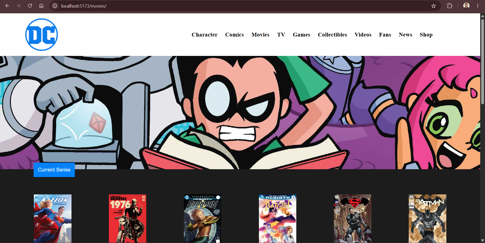
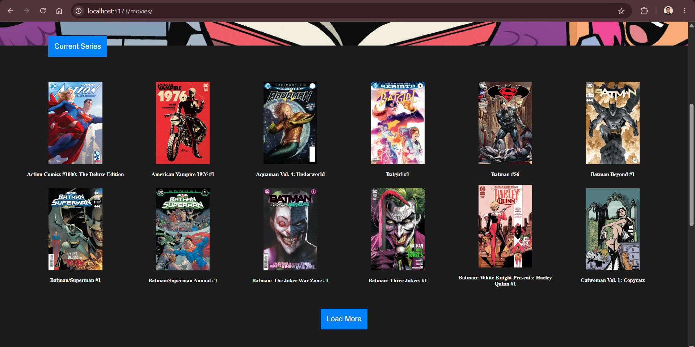
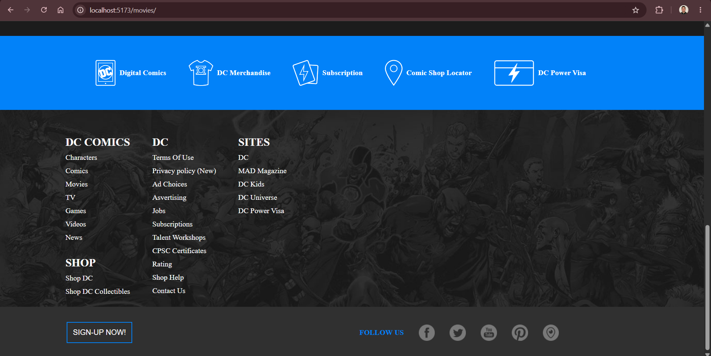

# React DC Comics

A static React application inspired by the DC Comics website, specifically focused on the comics section.

## Description

This project is a single-page application composed of three main sections:

- A **Header** containing the navigation bar.
- A **Main section** displaying a list of available comics.
- A **Footer** containing additional page links, a newsletter subscription button, and social media buttons.

## Technologies

**Front-end**: HTML5, CSS3, JavaScript, React

**Tools**: Git, npm, Visual Studio Code

## Screenshots

### Header

### Main section

### Footer
